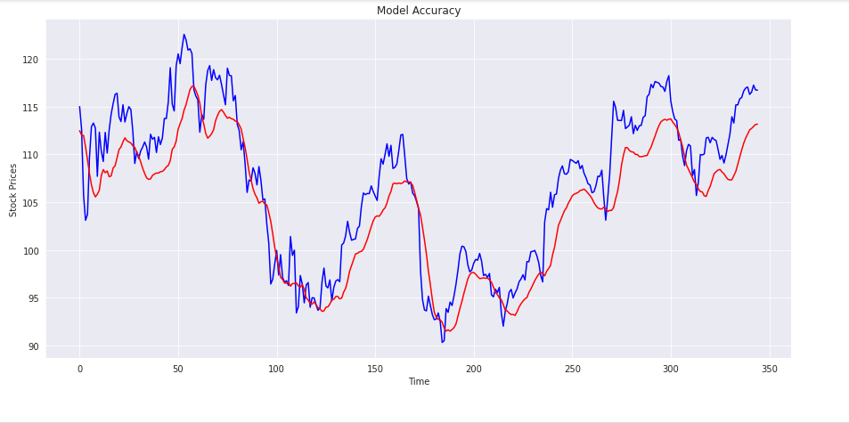

# Apple Inclusive Stock Prediction - New York Stock Exchange



This dataset is a playground for fundamental and technical analysis. It is said that 30% of traffic on stocks is already generated by machines, can trading be fully automated? If not, there is still a lot to learn from historical data.

Dataset link - https://www.kaggle.com/dgawlik/nyse

## Content
Dataset consists of the following files:

 - prices.csv: raw, as-is daily prices. Most of the data span from 2010 to the end of 2016, for companies new on the stock market date range is shorter. There have been approx. 140 stock splits in that time, this set doesn't account for that.

- prices-split-adjusted.csv: same as prices, but there have been added adjustments for splits.

- securities.csv: a general description of each company with the division on sectors.

- fundamentals.csv: metrics extracted from annual SEC 10K fillings (2012-2016), should be enough to derive most of the popular fundamental indicators.

## Requirements

```
import numpy as np
import pandas as pd
import matplotlib.pyplot as plt
import math
import seaborn as sns
from sklearn.preprocessing import MinMaxScaler
from keras.models import Sequential
from keras.layers import Dense, BatchNormalization, Dropout, Activation
from keras.layers import GRU, LSTM
from sklearn.metrics import mean_squared_error
from keras.optimizers import Adam, SGD, RMSprop
from keras.callbacks import ReduceLROnPlateau , ModelCheckpoint
```

## Contributing
Pull requests are welcome. For major changes, please open an issue first to discuss what you would like to change.

Please make sure to update the tests as appropriate.

## License
[MIT](https://choosealicense.com/licenses/mit/)
